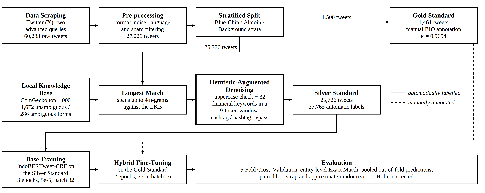

# Heuristic-Augmented Denoising in Distant Supervision for Crypto Assets Named Entity Recognition Using IndoBERTweet-CRF

Code, out-of-fold predictions and analysis tables for the paper by
Jonathan Davin, Clark Sompie, Shane Anthony, Henry Lucky, Bryan Dale and
Rifqi Charisma (Bina Nusantara University).

The dataset (Gold and Silver Standard in BIO format), the Local Knowledge Base
(LKB) and the base model checkpoints are on Mendeley Data:
[doi:10.17632/rtw4d5c6hj](https://doi.org/10.17632/rtw4d5c6hj).

## Abstract

Indonesia's rapidly expanding digital asset market has fostered an active
cryptocurrency community on Twitter (X), but extracting entities from informal
social media text is difficult because of the community's complex linguistic
registers, high out-of-vocabulary rates, and the scarcity of domain-specific
annotated datasets for Indonesian. This study proposes a hybrid Named Entity
Recognition (NER) pipeline built on an IndoBERTweet-CRF architecture. Distant
Supervision labels a Silver Standard of 25,726 tweets using the CoinGecko API as
a Local Knowledge Base, with a Heuristic-Augmented Denoising mechanism to
mitigate label noise from lexically ambiguous terms, after which the base model
is fine-tuned on a Gold Standard of 1,461 manually annotated tweets whose
token-level Fleiss' κ is 0.9654. Four comparative baselines and four ablated
variants are evaluated under an identical 5-Fold Cross-Validation protocol, with
differences assessed by paired bootstrap resampling and approximate
randomization under Holm correction. The proposed model reaches a mean
Precision of 83.28%, a Recall of 87.65%, and an F1-Score of 85.41%. Ablation
attributes 26.36 points of that score to hybrid fine-tuning, 5.19 to distant
supervision, and 1.25 to heuristic denoising, while the Conditional Random Field
layer is indistinguishable from a softmax head under a single-type,
predominantly single-token schema. Residual errors are dominated by
asset–platform metonymy and by a recall gap between entities inside the
knowledge base (0.9550) and outside it (0.5442).



## Results

Entity-level exact match on pooled out-of-fold predictions. All nine systems
use the same five folds. ΔF1 is measured against the proposed system. The p
value combines a paired bootstrap and an approximate randomization test
(100,000 resamples each), with Holm correction.

| System | Training data | P | R | F1 | 95% CI | ΔF1 | p (Holm) |
|---|---|---|---|---|---|---|---|
| Gazetteer longest-match | LKB only | 0.4691 | 0.8029 | 0.5922 | [0.564, 0.619] | −0.2619 | < 0.001 |
| BiLSTM-CRF | gold | 0.7887 | 0.6252 | 0.6975 | [0.667, 0.726] | −0.1566 | < 0.001 |
| mBERT-CRF | gold | 0.8227 | 0.8325 | 0.8276 | [0.805, 0.849] | −0.0265 | 0.028 |
| IndoBERT-CRF | gold | 0.8561 | 0.8553 | 0.8557 | [0.835, 0.875] | +0.0016 | 0.852 |
| IndoBERTweet-CRF [−DS] | gold | 0.8454 | 0.7631 | 0.8021 | [0.777, 0.826] | −0.0519 | < 0.001 |
| Base model, no fine-tuning [−FT] | silver | 0.4672 | 0.8020 | 0.5905 | [0.562, 0.617] | −0.2636 | < 0.001 |
| Proposed w/o denoising [−HD] | silver + gold | 0.8191 | 0.8655 | 0.8416 | [0.821, 0.861] | −0.0125 | 0.052 |
| IndoBERTweet-softmax [−CRF] | gold | 0.8209 | 0.7910 | 0.8057 | [0.782, 0.828] | −0.0484 | < 0.001 |
| **Proposed (DS + HD + FT)** | silver + gold | **0.8328** | **0.8765** | **0.8541** | [0.834, 0.873] | – | – |

Over three random seeds, the proposed system has a mean F1 of 0.8568 (std
0.0035) and the −HD variant has 0.8454 (std 0.0033). All tables in the paper
are in [`analysis/`](analysis/).

## Repository layout

```
code/
  config.py          paths, hyperparameters, Colab bootstrap
  utils.py           model, training, folds, metrics, significance tests, gazetteer
  test_utils.py      self-checks for utils.py (about 30 s)
  test_speed.py      speed check for the significance tests
notebooks/
  00_colab_setup.ipynb           folder layout, dependencies, checkpoint check
  01_data_analysis.ipynb         corpus statistics, denoising impact, IAA, tier audit
  02_baselines_ablation.ipynb    trains all nine systems, writes oof/*.jsonl
  03_significance_error.ipynb    significance tests, error analysis, paper tables
analysis/            every table reported in the paper, IAA annotations, error report
oof/                 out-of-fold predictions, one JSON line per gold sentence
  v2_tier/           mutually exclusive tier variant (Section IV-E, Limitations)
data/                empty; see data/README.md
figures/             Fig. 1
legacy/              original pipeline of the first submission (preprocessing, labeling, training)
```

The notebooks keep their outputs, so you can read every result without running
anything.

## Reproduce

The notebooks run on Google Colab with a T4 GPU. Notebook 02 takes about two
hours for all systems.

1. Download the data and checkpoints from
   [Mendeley Data](https://doi.org/10.17632/rtw4d5c6hj).
2. Put them on Google Drive in this layout:
   ```
   MyDrive/crypto-ner/
     code/   the four files from code/
     data/   gold_standard_bio_labeled.csv, silver_standard_bio.csv, lkb_*.json
     ckpt/   indobertweet-crf-base-denoised-matched/, indobertweet-crf-base-naive/
   ```
3. Run `notebooks/00_colab_setup.ipynb`, then notebooks 01, 02 and 03 in order.

If you run outside Colab, set the root folder with an environment variable:

```bash
export CRYPTO_NER_ROOT=/path/to/crypto-ner
```

Then install the dependencies:

```bash
pip install -r requirements.txt
```

Some steps need files that the public release does not include:

- The preprocessing funnel in notebook 01 needs the raw tweets.
- The naive silver set for the −HD ablation is built from the raw tweets. The
  released `indobertweet-crf-base-naive` checkpoint lets you run the −HD
  fine-tuning without it.

The raw tweets are not released because they contain user names and user IDs.

## Use a base checkpoint

The released checkpoints are the base models trained on the Silver Standard.
They are not config-based Hugging Face models: load the weights into
`TokenClassifier` from `code/utils.py`.

```python
import torch
from transformers import AutoTokenizer
from utils import TokenClassifier, load_state_dict_any, predict_words

path = "ckpt/indobertweet-crf-base-denoised-matched"
tokenizer = AutoTokenizer.from_pretrained(path)
model = TokenClassifier("indolem/indobertweet-base-uncased", use_crf=True)
model.load_state_dict(load_state_dict_any(path))

words = ["serok", "$BTC", "sama", "Solana", "sekarang"]
print(predict_words(model, tokenizer, [words], device="cpu"))
```

The input must use the same tokenization as the dataset:

```python
TOKEN_PATTERN = r"@USER|HTTPURL|\#\w+|\$\w+|[a-zA-Z0-9_]+|[^\w\s]"
```

## Citation

If you use this code or data, cite the paper and the dataset. See
[`CITATION.cff`](CITATION.cff).

## License

Code: MIT, see [`LICENSE`](LICENSE). Data and checkpoints: see the license on
the Mendeley Data page.
